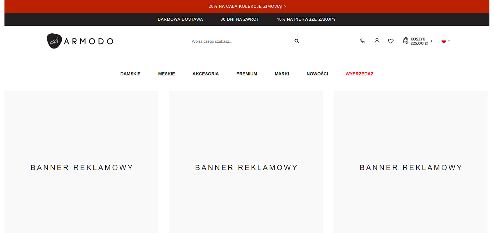

# Armodo Homepage

Homepage of Armodo website shop.

## Table of contents
* [General info](#general-info)
* [Screenshots](#screenshots)
* [Technologies](#technologies)
* [Status](#status)
* [Inspiration](#inspiration)

## General info

The motivation to create the project was to learn responsive design.

## Screenshots

## Technologies:
* HTML5
* CSS3/SASS
* JQuery 3.5.1
* Grid/Flexbox

## Setup
link to netlify

## Status
Project is: _in progress_

## Inspiration
Website project from "IAI Webcamp #9".
